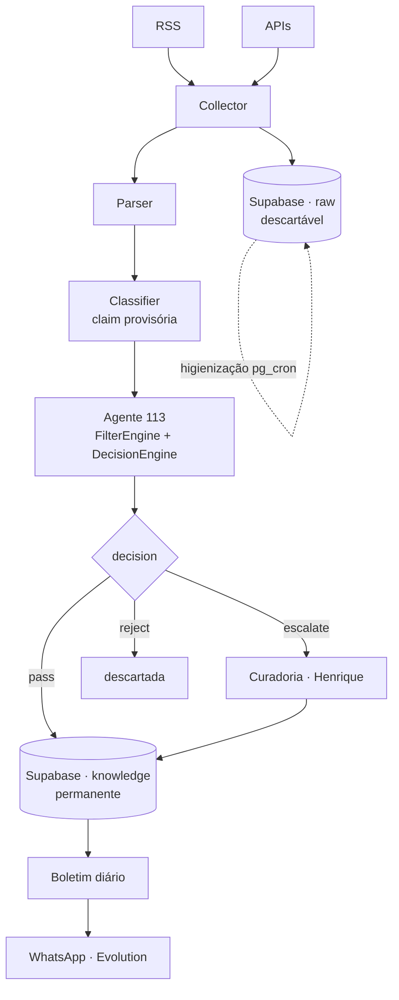

# Arquitetura — Sentinela HL

Este documento registra o **fluxo** e, principalmente, as **decisões** por trás
dele. O diagrama é a parte fácil; o valor real está em não perder o *porquê* —
para que ninguém "simplifique" seis meses depois algo que foi decidido de propósito.

## Diagrama do pipeline



## Camadas

- **Coleta / Parser** — buscam e normalizam informação dentro do escopo (ciência
  e pesquisa). O item bruto vai para `raw`.
- **Agente 113** — o núcleo de inteligência. `FilterEngine` audita a claim
  (proveniência, rótulo, calibração); `DecisionEngine` aplica a política.
- **Persistência** — `raw` (bruto, temporário) e `knowledge` (validado, permanente).
- **Boletim** — gera e entrega o resumo diário do conhecimento validado.

## Decisões de projeto (o porquê)

### 1. `raw` vs `knowledge` são schemas separados
`raw` é buffer descartável (coleta, logs, ruído); `knowledge` é memória permanente.
Só entra em `knowledge` o que passou pelos filtros e, quando exigido, pela
curadoria. Essa separação viabiliza auditoria, depuração e a higienização
automática — que **só** toca `raw` e nunca remove conhecimento.

### 2. O agente audita; não classifica do zero
A claim chega **já classificada provisoriamente** pelo classifier. O trabalho do
agente é verificar se essa classificação é **honesta**. Em ciência de fronteira
muitas vezes não existe uma fonte de verdade para "validar" — então o filtro não
pergunta "isso é verdade?", e sim "estamos representando o status disso com
honestidade?". **O rótulo epistêmico honesto é o produto.**

### 3. `FilterEngine` (avaliação) ≠ `DecisionEngine` (política)
`FilterEngine` só monta o prompt, chama o LLM e converte a resposta em
`Classification[]`. `DecisionEngine` é uma **função pura** (sem estado, sem I/O,
sem IA) que aplica a regra: `fail → reject`, `flag → escalate`, tudo `pass → pass`.
Mudar a política (ex.: "dois flags → reject") toca só o `DecisionEngine`.

### 4. Contrato único: `core/models.py` = schema SQL
Não existem dois contratos. Os enums Python espelham exatamente os enums do
PostgreSQL (verificado por teste cruzado). Divergência aqui = bug de serialização
silencioso na fronteira do banco.

### 5. n8n é orquestrador, não cérebro
`Cron → chama Python → recebe JSON → persiste/notifica`. Nunca regra de decisão
em nós de `IF`/transformação. Toda a inteligência vive no Python; o n8n vê o
agente como caixa-preta. Isso dá teste unitário, execução por CLI e reuso sem n8n.

### 6. Desacoplado de provedor via `LLMClient`
A aplicação conhece só o `LLMClient` (Protocol). `OpenRouterClient` e `FakeLLMClient` o implementam;
o modelo é escolhido por variável de ambiente. Trocar Claude → GPT → Gemini →
DeepSeek não toca em mais nada. Foi esse desacoplamento que permitiu testar todo
o pipeline offline com o `FakeLLMClient` — que não é acessório de teste, e sim
parte da arquitetura (CI sem tokens, benchmark determinístico, dev sem internet).

### 7. O prompt é artefato versionado
`prompts/filter_v1.md` — o prompt é o verdadeiro produto do Sentinela e vai
evoluir dezenas de vezes. Fica fora do código, versionado como o schema SQL.
Cada `Classification` registra `model` e `prompt_version` (auditoria).

### 8. Migrations divididas, nunca monolíticas
`001`–`011`, com dependências explícitas. A migration monolítica foi a causa dos
problemas iniciais de ambiente; a divisão os eliminou. Decisão congelada.

### 9. YAGNI — sem abstração antecipada
Sem Domains, Services, Repository, Use Cases, Factory ou DI. Estrutura plana por
tecnologia. A arquitetura será refatorada quando houver necessidade real, não por
previsão.

## Os 6 filtros (o agente audita)

| # | Filtro | Pergunta | Status |
|---|---|---|---|
| 1 | Proveniência | A fonte sustenta o que a claim afirma? | Implementado (113) |
| 2 | Rótulo epistêmico | O rótulo é honesto para a evidência? | Implementado (113) |
| 3 | Independência da fonte | Fonte única / preprint / baixa confiabilidade? | Milestone 2 |
| 4 | Calibração | A confiança condiz com a evidência? | Implementado (113) |
| 5 | Contradição | Conflita com o conhecimento já validado? | Milestone 3 (pgvector) |
| 6 | Extraordinariedade | Alegação fora do comum? | Milestone 2 |

## Política de decisão

```
qualquer fail  → reject
qualquer flag  → escalate  (requires_human_review = true → curadoria)
todos pass     → pass
```

O humano só toca o que é genuinamente ambíguo — o que mantém a curadoria diária
sustentável.
